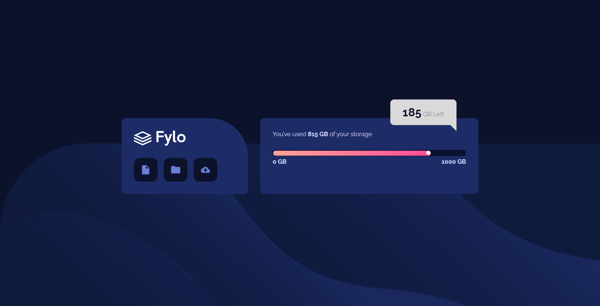

# Frontend Mentor - Fylo data storage component solution

This is a solution to the [Fylo data storage component challenge on Frontend Mentor](https://www.frontendmentor.io/challenges/fylo-data-storage-component-1dZPRbV5n). Frontend Mentor challenges help you improve your coding skills by building realistic projects. 

## Table of contents

- [Overview](#overview)
  - [The challenge](#the-challenge)
  - [Screenshot](#screenshot)
  - [Links](#links)
- [My process](#my-process)
  - [Built with](#built-with)
  - [What I learned](#what-i-learned)
- [Author](#author)

**Note: Delete this note and update the table of contents based on what sections you keep.**

## Overview

### The challenge

Users should be able to:

- View the optimal layout for the site depending on their device's screen size

### Screenshot



### Links

- Solution URL: [Code](https://github.com/m1mmseen/Frontend-Mentor-Fylo-Data-Storage)
- Live Site URL: [Github Page](https://m1mmseen.github.io/Frontend-Mentor-Fylo-Data-Storage/)

## My process

### Built with

- Semantic HTML5 markup
- SCSS (incl. imports, variables and mixins )
- Flexbox
- CSS Grid
- Mobile-first workflow

### What I learned

That was the first time i used sass/scss. I find that this makes the CSS code much easier to write. There is a clearer structure, especially for code that you use over and over again (e.g. Flexbox). You can easily use this code with mixin and include in the styling and even have the option of adding parameters, which enables easy customization.
To see how you can add code snippets, see below:

```css
@mixin flex($align: center, $justify: center) {
  display: flex;
  align-items: $align;
  justify-content: $justify;
}
```

```css
.scale {
  @include flex(center, space-between);
  font-weight: 700;
}
```

## Author

- Frontend Mentor - [m1mmseen](https://www.frontendmentor.io/profile/m1mmseen)
